# Informação Sobre o Ambiente

## Main:
- **Rede**: 192.168.5.0/24
- **IP Windows Server**: 192.168.5.1
- **IP Red Hat Server**: 192.168.5.2
- **IP Windows Server Core**: 192.168.5.3
- **IP Ubuntu Server SIEM**: 192.168.5.4
- **DNS Servers**: 192.168.5.1, 192.168.5.2
- **Default Gateway**: 192.168.5.254
- **Range de DHCP**: 192.168.5.19 - 192.168.5.35
- **DHCP Servers**: 192.168.5.1, 192.168.5.2

## Sucursal:
- **Rede**: 192.168.30.0/24
- **Ubuntu Client**: DHCP
- **Default Gateway**: 192.168.30.254/24
- **DHCP Server (pfSense)**: 192.168.30.254
- **Range DHCP**: 192.168.30.14 - 192.168.30.35

---
---

## pfSense:
**(imagens/screenshots de 00 até 12):**
- Reset do pfSense, (4 reset to factory defaults).
- Configurar interface pfSense, (2 set interface(s) IP address).
- Configurar apenas a LAN, estático, (2 - LAN).
- Configurar via DHCP, não.
- Definir IP: 192.168.30.254.
- Definir LAN subnet: 24.
- Apenas para LAN, pressione Enter (para "none").
- Configurar IPv6 via DHCP, não.
- LAN IPv6 address, pressione Enter (para "none").
- Configurar e habilitar DHCP server na LAN, sim.
- Configurar o range do IP: 192.169.30.14 - 192.168.30.35.
- Reverter protocolo para HTTP como WebConfigurator protocol, sim.
- Pressione Enter para continuar.
- Ok.

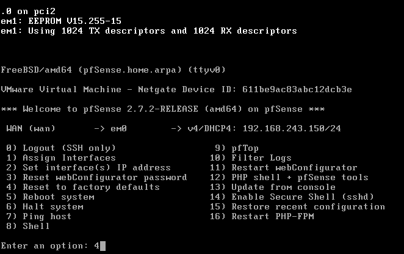
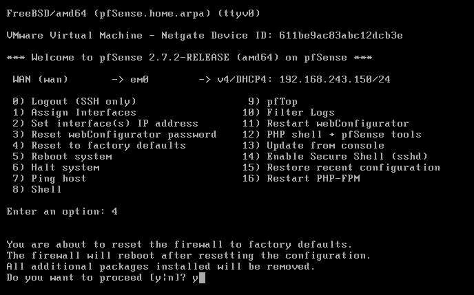

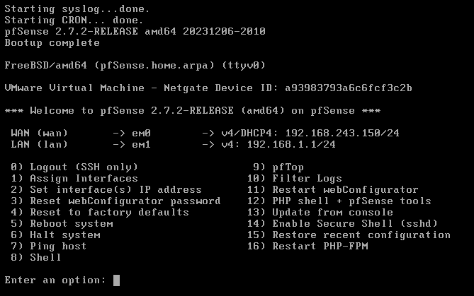
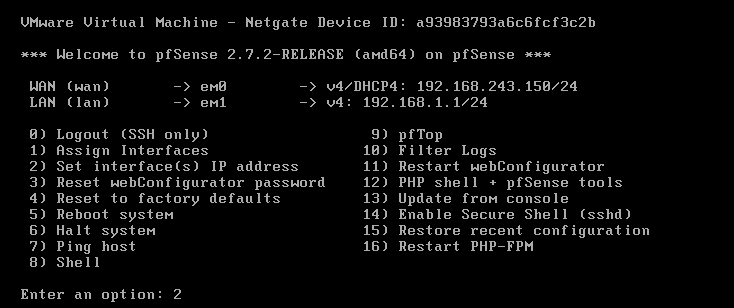
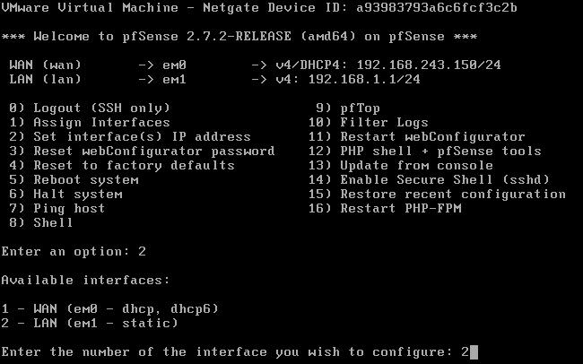
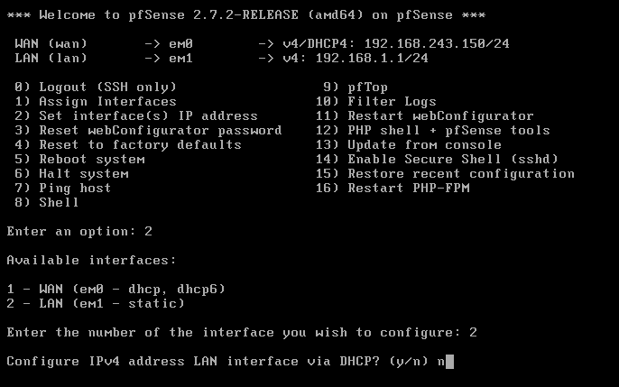
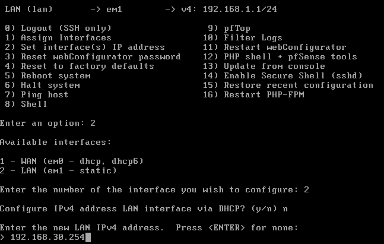
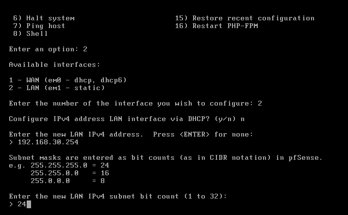
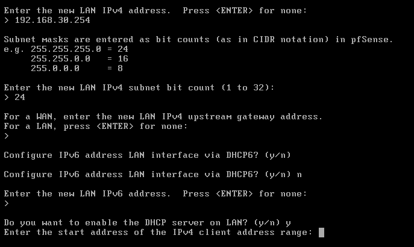
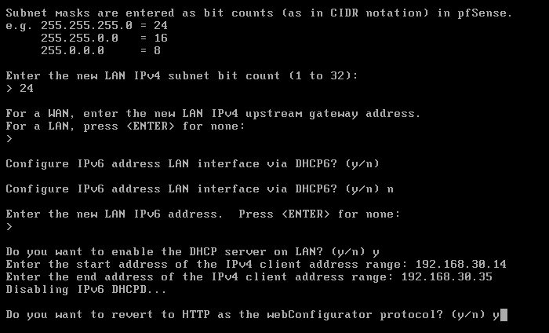
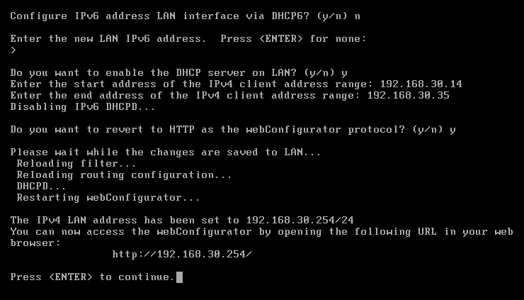
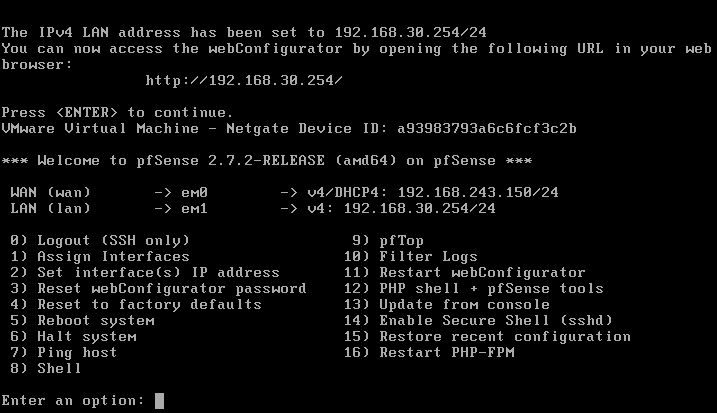
