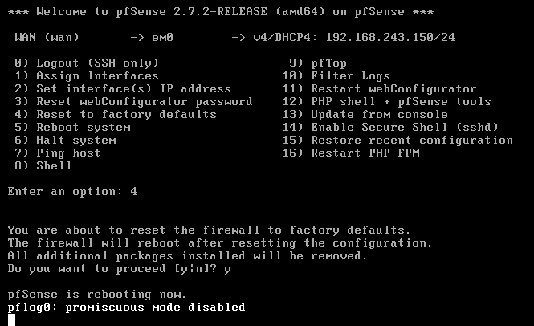
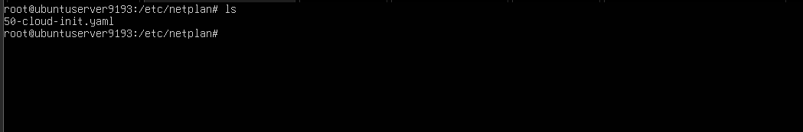
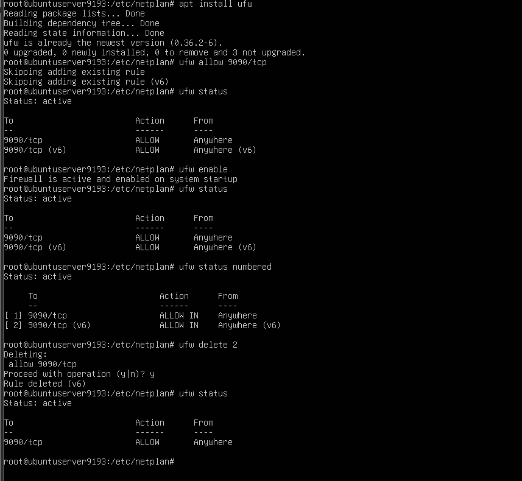

# Informação Sobre o Ambiente

## Main:
- **Rede**: 192.168.5.0/24
- **IP Windows Server**: 192.168.5.1
- **IP Red Hat Server**: 192.168.5.2
- **IP Windows Server Core**: 192.168.5.3
- **IP Ubuntu Server SIEM**: 192.168.5.4
- **DNS Servers**: 192.168.5.1, 192.168.5.2
- **Default Gateway**: 192.168.5.254
- **Range de DHCP**: 192.168.5.19 - 192.168.5.35
- **DHCP Servers**: 192.168.5.1, 192.168.5.2

## Sucursal:
- **Rede**: 192.168.30.0/24
- **Ubuntu Client**: DHCP
- **Default Gateway**: 192.168.30.254/24
- **DHCP Server (pfSense)**: 192.168.30.254
- **Range DHCP**: 192.168.30.14 - 192.168.30.35

---
---

### pfSense:

**(imagens/screenshots de 00 até 12):**
- Reset do pfSense, (4 reset to factory defaults).
- Configurar interface pfSense, (2 set interface(s) IP address).
- Configurar apenas a LAN, estático, (2 - LAN).
- Configurar via DHCP, não.
- Definir IP: 192.168.30.254.
- Definir LAN subnet: 24.
- Apenas para LAN, pressione Enter (para "none").
- Configurar IPv6 via DHCP, não.
- LAN IPv6 address, pressione Enter (para "none").
- Configurar e habilitar DHCP server na LAN, sim.
- Configurar o range do IP: 192.169.30.14 - 192.168.30.35.
- Reverter protocolo para HTTP como WebConfigurator protocol, sim.
- Pressione Enter para continuar.
- Ok.

---

### ubuntu_server_siem:

**(imagens/screenshots de 00 até 13):**
- Configurar IP estático para interface de rede.
- Não precisa de DHCP, pois o IP é estático.
- O arquivo não aceita tab, apenas espaço.
- Salvar arquivo.
- Aplicar novas definições, `netplan apply`.
- Verificar IP definido, `ip address`.
- Se tiver proxy, garanta que o IP do ubuntu_server_siem esteja no bypass.
- Ping ao Windows Server, ping ao pfSense.
- Instalar o Cockpit, para acessar via web o ubuntu_server_siem.
- Habilitar serviço Cockpit no init do boot.
- Verificar status, ok.

### ubuntu_server_siem:

**(imagens/screenshots de 14 até 20):**
- Instalar Ubuntu Firewall UFW, para disponibilizar a porta de acesso ao Cockpit (porta 9090) e dar mais segurança ao ubuntu_server_siem.
- Disponibilizar e permitir UFW para a porta 9090 do protocolo TCP: `ufw allow 9090/tcp`.
- Habilitar o UFW: `ufw enable`.
- Verificar status: `ufw status`.
- Verificar portas enumeradas: `ufw status numbered`.
- Desnecessário IPv6, remover: `ufw delete 2`.
- Verificar status: `ufw status`.
- Verificar o serviço Cockpit: `start`, `restart`, `enable`, `status`.
- Fazer ping para o ubuntu_server_siem a partir do Windows Server.
- Acessar o ubuntu_server_siem via Cockpit pela web.

### ubuntu_server_siem:
**(imagens/screenshots de 21 até 28):**
- Instalar o SIEM (Wazuh).
- Acessar o terminal via web Cockpit, acessar como root.
- Acessar o quickstart do Wazuh para instalação.
- No terminal web Cockpit do ubuntu_server_siem, fazer o download e rodar o script: `curl -sO https://packages.wazuh.com/4.9/wazuh-install.sh && sudo bash ./wazuh-install.sh -a`
- Progresso da instalação.
- Wazuh instalado, usuário é `admin`, senha é `nr65aUZPPXGwJcDY5e+vi6tptnhVqT??`.

